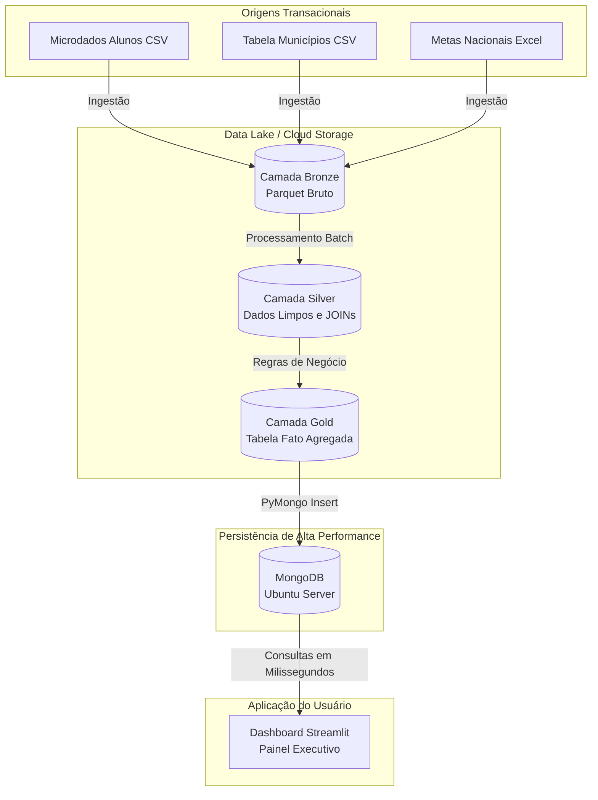

# 🚀 Tech Challenge Fase 2 — FIAP AI Scientist

Este projeto é uma evolução analítica que implementa um Pipeline de Dados de ponta a ponta focado em **Educação Pública**. O objetivo é transformar um alto volume de microdados educacionais do INEP (mais de 270 MB e 2.2 milhões de alunos) em métricas de negócio acionáveis sobre a **Alfabetização no Brasil** através de uma **Arquitetura Medallion**, consumida em alta performance por um banco de dados NoSQL e exibida em um Dashboard Interativo.

---

## 🔬 Metodologia CRISP-DM Aplicada

| Fase | Entregável |
| :--- | :--- |
| **1. Entendimento do Negócio** | Definição da métrica chave de Alfabetização: Ponto de corte de 743 pontos no Saeb para considerar a criança alfabetizada, analisando distribuição por UF e Município. |
| **2. Entendimento dos Dados** | Análise de 6 bases de dados do INEP/Base dos Dados, incluindo microdados de alunos, metas nacionais e tabelas de municípios, tratando codificações `latin1` e tipos mistos. |
| **3. Preparação dos Dados** | Pipeline Batch em Python/Pandas escalável (Medallion: Ingestão de CSV/Excel, Limpeza, Conversão para formato colunar Parquet, JOINs e Agregação de milhões de linhas). |
| **4. Modelagem (Estrutural)** | Modelagem do esquema analítico (Camada Gold) voltado ao desempenho de leitura para inserção em banco orientado a documentos (MongoDB). |
| **5. Avaliação** | Validações estruturais das tabelas geradas e checagem da métrica oficial de distribuição demográfica. |
| **6. Deploy & Consumo** | Persistência em MongoDB rodando em servidor Ubuntu e Dashboard Streamlit Interativo com tema personalizado (Intergaláctico). |

---

## 🏗️ Arquitetura da Solução (Data Lakehouse & NoSQL)

Abaixo apresentamos o fluxo arquitetural de dados do nosso projeto, desenhado para escalar análises governamentais utilizando a consagrada **Arquitetura Medallion**:

---

## 🧩 O Funil Medallion

A Arquitetura Medallion foi implementada e otimizada (FinOps) utilizando formato `.parquet` para garantir qualidade progressiva dos dados com baixo custo de storage:

1. **Bronze (Raw Data)**: Repositório de aterrissagem. Recebe os dados em seu formato original convertidos de CSV para Parquet, mantendo o histórico inalterado (landing zone).
2. **Silver (Enriched Data)**: Camada de qualidade. Aplicação das regras de engenharia: remoção de nulos, tipagem correta de dados e os cruzamentos (JOINs) entre a tabela gigantesca de alunos com as chaves das tabelas de municípios.
3. **Gold (Business Level Data)**: Camada de consumo. Dados sumarizados pela métrica oficial de >= 743 pontos do Saeb, modelados especificamente para responder às perguntas de negócio, prontos para injeção no MongoDB.

---

## 👥 Integrantes do Grupo

- **Engenharia de Dados & Pipeline**: Leonardo Jr. G. Mendoza (RM 373713)
- **Infraestrutura NoSQL**: Caio Morais Rubino (RM 371492)
- **Documentação & Governança Cloud**: Winny Tavares (RM 371471)
- **Desenvolvimento Frontend / BI**: Reinaldo Fernandes (RM 371717)
