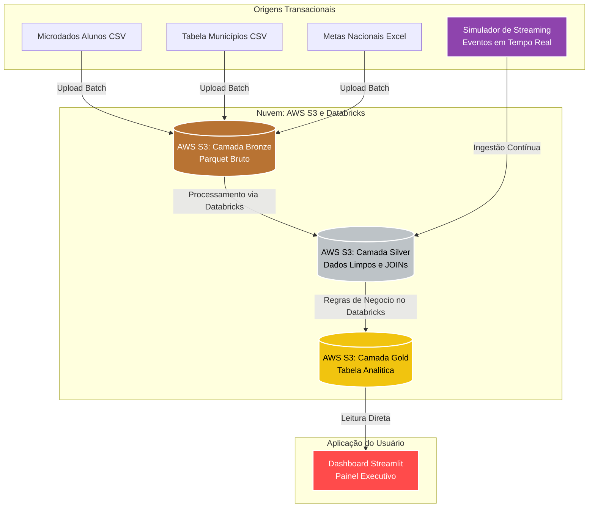

# 🚀 Tech Challenge Fase 2 — FIAP AI Scientist

Este projeto é uma evolução analítica que implementa um Pipeline de Dados de ponta a ponta focado em **Educação Pública**. O objetivo é transformar um alto volume de microdados educacionais do INEP (mais de 270 MB e 2.2 milhões de alunos) em métricas de negócio acionáveis sobre a **Alfabetização no Brasil** através de uma **Arquitetura Medallion**, consumida em alta performance por um banco de dados NoSQL e exibida em um Dashboard Interativo.

---

## 🔬 Metodologia CRISP-DM Aplicada

| Fase | Entregável |
| :--- | :--- |
| **1. Entendimento do Negócio** | Definição da métrica chave de Alfabetização: Ponto de corte de 743 pontos no Saeb para considerar a criança alfabetizada, analisando distribuição por UF e Município. |
| **2. Entendimento dos Dados** | Análise de 6 bases de dados do INEP/Base dos Dados, incluindo microdados de alunos, metas nacionais e tabelas de municípios, tratando codificações `latin1` e tipos mistos. |
| **3. Preparação dos Dados** | Pipeline construído com Databricks e PySpark (Medallion: Ingestão, Limpeza, Conversão para Parquet, JOINs). |
| **4. Modelagem (Estrutural)** | Modelagem do esquema analítico (Camada Gold) hospedado em um Data Lake na AWS S3. |
| **5. Avaliação** | Validações estruturais das tabelas geradas e checagem da métrica oficial de distribuição demográfica. |
| **6. Deploy & Consumo** | Dashboard Streamlit Interativo consumindo dados diretamente da camada Gold. |

---

## 🏗️ Arquitetura da Solução (Data Lakehouse & NoSQL)

Abaixo apresentamos o fluxo arquitetural de dados do nosso projeto, desenhado para escalar análises governamentais utilizando a consagrada **Arquitetura Medallion**:

---

## 🔄 Justificativa da Arquitetura Híbrida (Batch vs Streaming)

Atendendo aos requisitos de um **Pipeline Híbrido**, o projeto combina duas abordagens de ingestão:
- **Batch**: Utilizado para fontes históricas e de baixa frequência de atualização (Metas Nacionais, Cadastro de Municípios), processadas periodicamente na camada Bronze.
- **Streaming**: Implementado através do script `src/ingestion/streaming_simulator.py`. Para simular a chegada de novas avaliações de alunos quase em tempo real, criamos um Producer em Python que injeta eventos contínuos no fluxo. **Decisão de Arquitetura (FinOps):** Optamos por construir um simulador em Python (dispensando a infraestrutura complexa do Apache Kafka) por ser uma solução mais aderente (leve e econômica) ao volume de dados da simulação, garantindo excelente relação custo-benefício e alinhamento com as melhores práticas operacionais.

---

## 🧩 O Funil Medallion

A Arquitetura Medallion foi implementada e otimizada (FinOps) utilizando formato `.parquet` para garantir qualidade progressiva dos dados com baixo custo de storage:

1. **Bronze (Raw Data)**: Repositório de aterrissagem no AWS S3. Recebe os dados em seu formato original, mantendo o histórico inalterado (landing zone).
2. **Silver (Enriched Data)**: Camada de qualidade. O Databricks processa os dados da Bronze, aplica limpeza, tipagem e faz JOINs, salvando novamente no AWS S3.
3. **Gold (Business Level Data)**: Camada de consumo. O Databricks sumariza os dados pela métrica oficial do Saeb, modelados para consumo direto pelo Dashboard Streamlit.

---

## 👥 Integrantes do Grupo

- **Engenharia de Dados & Pipeline**: Leonardo Jr. G. Mendoza (RM 373713)
- **Infraestrutura Cloud**: Caio Morais Rubino (RM 371492)
- **Documentação & Governança Cloud**: Winny Tavares (RM 371471)
- **Desenvolvimento Frontend / BI**: Reinaldo Fernandes (RM 371717)
